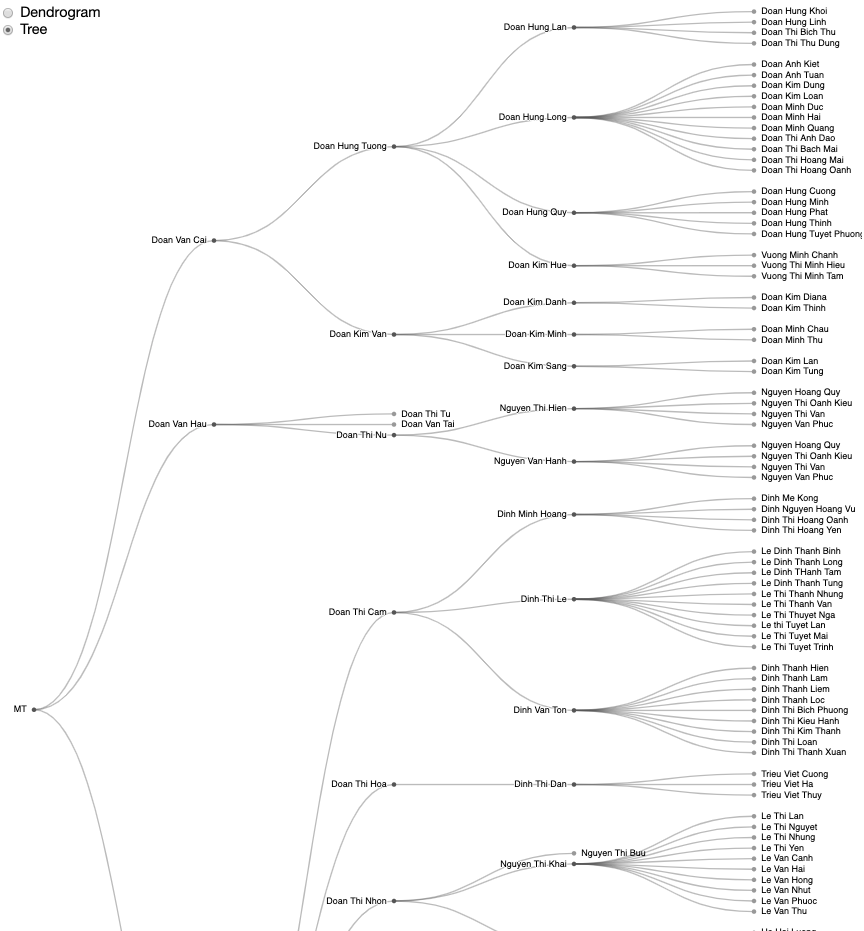

# Family Tree Visualization
A d3 visualization of my paternal ancestral family tree.

## Visualization



## Steps to run
In the directory of the project, start server:

```python3 -m http.server 3000 ```

The project is now unning at localhost:3000.
